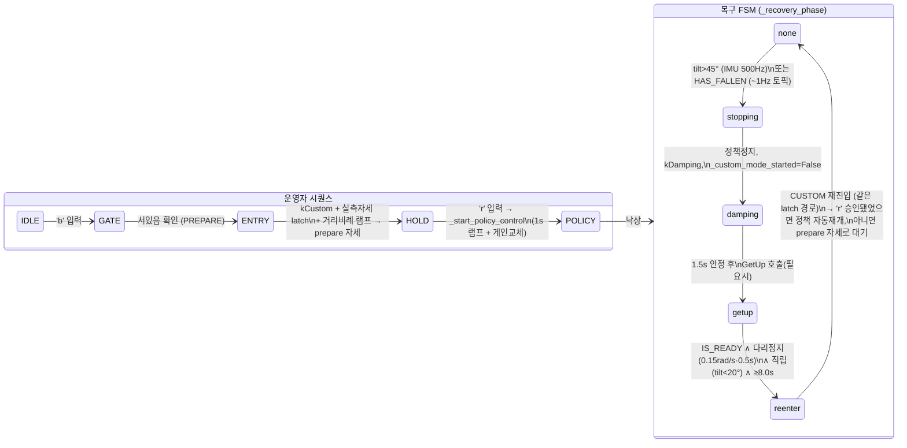

# 낙상감지 → GetUp → PREPARE → CUSTOM: FSM 설계 플레이북

작성 2026-08-20. 대상 독자: **이 저장소 밖의 사람** (custom motion wrapper 를 만드는 팀원).
모든 숫자에 출처를 달았다 — `파일:행` 은 코드/설정, `§` 는 이 저장소의 실험 기록(`ibatch.md`),
날짜는 실기 사고다. 구현체는 `htwk-gym/deploy/deploy_goal_pose.py` 와
`htwk-gym/deploy/configs/Goal_Pose_E0.yaml` 하나씩이다.

> **요약 한 줄**: 이 FSM 의 모든 가드와 숫자는 이론이 아니라 **사고 하나당 하나씩** 생겼다.
> 로봇을 눕혀 복구를 4번 시험해 4번 다 관절보호(빨간불)로 떨어진 날(2026-08-07)이
> 이 문서의 절반을 만들었다. §6 연대기를 먼저 읽고 오면 나머지가 다 "왜"가 보인다.

---

## 0. 전체 그림



핵심 설계 결정 다섯 개:

| # | 결정 | 한 줄 이유 |
|---|---|---|
| 1 | **리턴 코드를 안 믿고 상태 토픽을 믿는다** | `ChangeMode` 가 rc=100(1.000s 타임아웃)을 돌려준 전환이 실제로는 성공해 있었다 |
| 2 | **트리거와 확정을 분리한다** — IMU(500Hz)가 트리거, 토픽(~1Hz)이 확정 | 1Hz 토픽으로 트리거하면 넘어지는 로봇을 최대 1초 더 정책이 몬다 |
| 3 | **완료 판정은 상태 플래그 + 물리 신호 이중** | SDK 의 IS_READY 는 get-up 동작이 끝나기 *전에* 뜬다 (4.9s vs 실측 8.0s) |
| 4 | **자세 이동은 시간 고정이 아니라 거리 비례 램프** | 고정 2s 램프가 96° 이동을 0.8 rad/s 로 끌어 관절보호를 터뜨렸다 |
| 5 | **최초 시작과 복구 재진입은 같은 함수를 지난다** | 인라인이면 재진입이 그 코드를 안 지나간다 — 게인 5배 고착이 그렇게 생겼다 |

---

## 1. 진실원(source of truth) — 신호 4개, 각자 역할이 다르다

| 신호 | 토픽/원천 | 율 | 역할 | 실패 시 |
|---|---|---|---|---|
| **로봇 모드** | `/robot_states` (`RobotStatesMsg.current_mode`) | 미측정, **5.0s stale 컷**만 강제 | CUSTOM 진입 전 "지금 정말 서 있나(PREPARE)" 확인 | import 실패 시 **fail-open**(경고 후 진입) — 대신 §3 의 물리 신호 가드가 지킨다 |
| **낙상 상태** | `/fall_down` (typed) **+** `/fall_down_recovery_state` (raw 3바이트) **동시 구독** | 실측 **~1 Hz** | HAS_FALLEN 확정, `is_recovery_available`(GetUp 가능 여부 — 이게 False 면 GetUp 호출은 그냥 실패함) | 발행자 하나가 죽어도 다른 쪽이 살아 있게 이중화. 둘 다 죽으면 IMU 단독(blind) 분기 |
| **IMU tilt** | LowState `imu_state.rpy` → 중력을 몸통좌표로 회전 → `tilt = arccos(−g_z)` | 명목 500 Hz, 실측 ~360~380 Hz (코드 주석에 두 값 공존) | **낙상 트리거 fast path** + get-up 완료의 "직립" 조건 | 폴백 없음 (무조건 계산됨) |
| **다리 관절속도** | LowState `motor_state_serial[].dq` (위생 게이트 통과분) | 콜백과 동일 | get-up 완료의 "동작 끝남" 신호 | 게이트가 비정상 표본을 직전값 유지로 대체 |

⛔ **tilt 를 raw roll/pitch 로 재지 마라.** ZYX 오일러는 pitch ±90° 근처에서 roll 이
퇴화한다 — 엎드린 로봇(pitch 78.8°)이 **roll 172.7°** 를 보고해 "뒤집혀 누움"으로 읽힌
실측 사례가 있다. 중력-몸통좌표 방식은 특이점이 없고, **정책 관측 obs[0:3] 과 같은
양**이라 안전 판정과 정책 입력이 서로 어긋날 수 없다. (`deploy_goal_pose.py:970-978`)

⛔ **rc=100 사례** (`deploy_goal_pose.py:252-253` 실측 기록): `ChangeMode()` 가 1.000s
타임아웃 끝에 rc=100 을 돌려줬는데 전환은 이미 성공해 있었다. ⇒ 모드 전환류 API 의
리턴값으로 성공/실패를 판정하는 코드는 전부 신뢰 불가. **전환을 요청한 뒤 상태 토픽이
그 모드를 보고할 때까지 폴링**하는 것이 유일하게 맞는 방법이다.

---

## 2. 정상 기동: 'b' → 'r'

### 2-1. 'b' — CUSTOM 진입 게이트 (`_ensure_standing_before_custom`, :1566-1650)

```
/robot_states age > 5.0s        → 거부(raise). 모드를 모르면 안 들어간다
mode == PREPARE                 → 통과
HAS_FALLEN (fall age<5.0s)      → is_recovery_available 확인 → GetUp(API 2008) 호출
                                   → 0.3s 폴링, 20.0s 타임아웃 → 1.0s settle
그 외 (DAMPING 등)              → ChangeMode(kPrepare) → 0.2s 폴링, 15.0s 타임아웃
```

**왜**: 예전엔 아무 가드가 없어서 DAMPING(축 늘어진 상태)에서 곧바로 kCustom 이
걸렸고 — 정책이 **바닥에 널브러진 로봇** 위에서 시작됐다. kPrepare 가 곧 기립
모드("양발로 서 있고 걷기로 전환 가능")라 이것을 진입 전제로 강제한다.

### 2-2. CUSTOM 진입 (`_enter_custom_latched`, :1381-1565)

1. **지금 실측 자세를 latch** 해서 t=0 명령으로 삼는다 ⇒ 진입 순간 명령 스텝이
   **구조적으로 0** (어떤 자세에서 왔든).
2. `ChangeMode(kCustom)` → LowState 재개 대기(3.0s 하드코딩, :1367).
3. latch 자세 → **prepare 자세**로 smoothstep 램프. 램프 시간은 거리 비례:

   ```
   ramp_s = clamp( 다리 최대이동(rad) / 0.3 rad/s ,  하한 2.0s ,  상한 8.0s )
   ```
   실측 예: 최초진입 0.49 rad → 2.0s(하한) / 복구 재진입 1.59~1.68 rad → 5.3~5.6s.
   ⛔ 구 코드는 고정 2.0s 라 재진입 1.68 rad(96°)를 **0.8 rad/s** 로 끌었다 → 관절보호.

4. 이 구간의 게인은 **prepare 게인**(강성 위치서보): kp `[350,350,180,350,250,250]`
   / kd `[7.5,7.5,3,5.5,5,5]`. 정책 게인은 `[100,100,100,100,50,50]` / `[2,2,2,2,1,1]`
   — **발목 kp·kd 5배, 힙·무릎 kp 3.5배** 차이다. (yaml:125-139 vs 49-64)

### 2-3. b~r 구간 — **균형을 닫는 주체가 없다**

'b' 와 'r' 사이에는 정책이 안 돌고 위치서보만 있다. 그래서 붙잡는 자세는
**개루프로 서 있을 수 있어야** 한다. 평면 다리에서 그 조건은:

```
hip_pitch + knee_pitch + ankle_pitch = 0    (발 평평 + 몸통 수직)
prepare 자세: −0.1 + 0.2 + (−0.1) = 0.00  ✅
RL(학습) 자세: −0.2 + 0.4 + (−0.25) = −0.05  ⛔ (2.9° 어긋남)
```

**실측 근거** (2026-08-07, `--hold-diag 15`): RL 자세를 붙잡으니 관절 추종은 완벽
(전 관절 max 0.0108 rad = **0.6°**)한데 **몸통 tilt 가 4.9~13.8°** 로 15초 내내 흔들렸다.
= 서보 문제가 아니라 **명령한 자세 자체가 곧게 못 서는 것**. 발끝 여유 12.15 cm 에서
13.8° tilt 는 CoM ~11.6 cm 전방 이동(여유의 96%)이다. prepare 자세(합=0)로 바꾼 뒤
실측 tilt: **median 1.4°** (106s 서기), 복구 후 구간은 median 0.7°.

⇒ 교훈: **"관절이 명령을 따라간다" 와 "로봇이 서 있다" 는 다른 명제다.** 추종 오차만
로깅하면 이 문제는 영원히 안 보인다 — 몸통 tilt 를 같이 봐야 한다.

### 2-4. 'r' — 정책 시작 (`_start_policy_control`, :1938-2003)

prepare 자세 → RL 자세 **1.0s** smoothstep 램프(여기 최대 이동은 무릎 0.2 rad 뿐이고
램프가 끝나는 순간 정책이 균형을 닫으므로 진입 램프만큼 느릴 필요 없음, yaml:304-307)
→ 램프 끝에서 **publish_lock 임계구역 안에서** 게인 교체 + `_policy_gains_active=True`.
⚠️ `policy.reset()` 은 **여기서 부르지 않는다** — 최초 'r' 시점의 정책 내부 상태는
어차피 초기값이다. reset 은 **복구 재진입(reenter)에서만** 별도로 호출된다(:1923-1925,
액션 이력·gait 위상·관측 히스토리 5종 초기화). 낙상 직전 상태가 새 시도로 새어
들어가는 것을 막는 것이 목적이므로 필요한 곳이 정확히 거기다.

⛔ **이 함수가 존재하는 이유가 이 문서에서 제일 중요한 교훈이다**: 원래 이 로직은
'r' 처리부에 인라인이었고 호출자가 `__main__` 하나였다. ⇒ **복구 재진입 경로는 이
코드를 한 번도 지나지 않았다.** 결과: 첫 낙상 이후의 모든 보행이 prepare 게인
(발목 5배) 위에서 돌았고, 자세 램프도 없이 첫 추론이 자세 계단을 만들었고,
`_policy_gains_active` 가 False 로 고착돼 부가 기능이 조용히 자기 무력화됐다.
3중 독립 감사(전문정독/AST/스텁구동)가 만장일치 1순위로 이걸 지목했다(2026-08-08).
reset 이 재진입에만 있는 것도 이 감사의 산물이다 — 원래는 `reset()` 메서드 자체가
존재하지 않았다.
⇒ **규칙: 최초 진입과 재진입이 반드시 같은 함수를 지나게 하라. 그리고 그것을
정적으로 검증하라** (우리 테스트 T10: 호출자 집합이 정확히 {r 처리부, 복구 FSM} 인지
AST 로 확인).

---

## 3. 낙상 감지 — 두 경로

| 경로 | 조건 | 지연 | 행동 |
|---|---|---|---|
| **fast** (`_low_state_handler`, :986-1011) | `tilt > 0.785 rad (45°)` | ~2.6 ms (콜백마다) | `_request_recovery()` |
| **slow** (메인 루프) | `/fall_down == HAS_FALLEN`, age<5.0s | 최대 ~1 s | 동일 |

`_request_recovery` 의 **무시 조건 둘** (:1690-1720):
1. 이미 복구 중이면 무시 (중복 방지)
2. **`_custom_mode_started == False` 면 무시** — LowState 콜백은 CUSTOM 요청 전부터
   돈다. 이 가드가 없으면 프로세스 시작 시점에 로봇이 이미 누워 있을 때 (아직 SDK 가
   주도권을 가진 상태에서) 복구 시퀀스가 예약됐다가 운영 시작 순간 발사된다.

별도로, 후보 정책 시험용 `--test-tilt-abort-deg`(예: 25°)는 45° 낙상 문턱보다 **훨씬
낮게** 잡아 복구 시퀀스를 아예 안 태우고 프로세스를 끝낸다 — 시험 중 낙상은
"복구할 사건"이 아니라 "데이터 찍고 끝낼 사건"이기 때문이다.

---

## 4. 복구 FSM (`_step_recovery`, :1749-1936)

phase 는 문자열 하나(`none/stopping/damping/getup/reenter`), 전이는 전부 명시적.

### stopping (1틱)
정책 정지, `ChangeMode(kDamping)`, `_custom_mode_started=False`, `_policy_gains_active=False`.

### damping
**1.5s** (`damping_settle_s`) 기다린 뒤:
- 이미 `IS_READY` 면 GetUp **생략**하고 getup phase 로 (이때 8s 하한도 생략 — 아래)
- 아니면 `GetUp`(API 2008) 호출. 단 `is_recovery_available == False` 가
  **10.0s** (`recovery_wait_timeout_s`) 지속되면 포기(사람 개입 필요).

### getup — **완료 판정이 이 FSM 의 심장이다**

```
완료 = state_ok ∧ quiet
state_ok = (IS_READY) ∧ (경과 > min_wait) ∧ (tilt < 0.35 rad = 20°)
quiet    = 다리 12관절 peak|dq| < 0.15 rad/s 가 0.5s 연속 유지
min_wait = 8.0s (GetUp 을 실제로 불렀을 때만; 생략했으면 0)
포기     = 20.0s (getup_timeout_s)
```

각 항의 근거:
- **8.0s**: HAS_FALLEN→IS_READY 실측값. 구 코드는 `IS_READY ∧ 경과>2.0s` 로 판정해
  **4.9s 에 재진입** — get-up 의 다리 접기 동작이 아직 진행 중이었고, 그 중간 자세를
  latch 해서 1.6 rad 를 끌다 관절보호에 걸렸다. **IS_READY 는 "일어나기 시작해도 됨"
  이지 "동작 끝남"이 아니다.**
- **quiet (0.15 rad/s · 0.5s)**: 시간이 아니라 동작 자체의 종료를 재는 신호. 다리
  관절속도가 0 근처로 떨어지면 접기가 끝난 것이다. LowState 에서 직접 읽으므로
  `/robot_states` 없는 빌드에서도 동작한다.
- **직립 20° (0.35 rad)**: `/fall_down` 이 ~1Hz 라 DAMPING 직후 stale 한 IS_READY 를
  들고 있을 수 있다 — 그때 다리는 축 늘어져 있어서 quiet 조건이 **거짓 양성**이 된다.
  tilt 는 500Hz LowState 산출이라 stale 창이 없다. 정상 서기 tilt 실측이 최대 13.8° 라
  그 위 여유로 20°.
- fall 토픽이 아예 없으면(blind): 직립 ∧ 경과 > **12.0s** (`getup_blind_wait_s`).
  ⚠️ 이 12.0 은 config 에 근거 주석이 없는 값이다(8.0 실측 + 마진으로 추정될 뿐) —
  옮겨 쓸 거면 자기 로봇에서 재측정하라.

### reenter
§2-2 와 **같은** `_enter_custom_latched` 를 다시 지난다(경로 통일). 그 다음:
- **`_policy_authorized`(운영자가 'r' 을 누른 적 있음) == True** → `_start_policy_control`
  + `policy.reset()` → 보행 자동 재개
- False → prepare 자세로 서서 'r' 대기. **복구의 임무는 로봇을 세우는 것까지다 —
  걷기 시작은 자동 복구 뒤에도 사람의 명시적 행동으로 남긴다.**

### 대기 루프 안에서도 FSM 은 돈다
'b'/'r' 프롬프트 대기 루프가 매 반복 `_step_recovery()` 를 호출한다. **왜**: 프롬프트
대기가 실측 최대 **124초**였고, 그 사이 낙상하면 "FALL DETECTED 로그만 찍히고 DAMPING
도 get-up 도 안 도는" 버그가 실재했다(2026-08-08 감사 발견).

### 종료(cleanup)의 모드 선택
- **기본 = `kDamping`** (fail-safe: 원인 모를 종료·예외·시그널 전부)
- 의도된 종료(시험 시간 만료)만 **`kPrepare`** (서서 끝남)
- `ChangeMode` 는 `_custom_mode_started == True` 일 때만 보낸다 (주도권이 없었으면
  아무것도 안 건드림)
- ⚠️ **하네스에 매단 채 돌리지 마라**: tilt>45° → kDamping(하네스 안에서 툭 떨어짐)
  → 공중에서 GetUp 시도 → 복귀조건 불충족 → 20s 타임아웃. 실경험이다.

---

## 5. 숫자 총표

| 키 | 값 | 근거 | 출처 |
|---|---|---|---|
| `fall_tilt_limit_rad` | **0.785 (45°)** | 낙상 판정. 정상 서기 tilt(≤13.8° 실측)와 명확히 분리 | yaml:191 |
| `low_state_timeout_s` | 0.20 s | LowState 신선도 컷 | yaml:185 |
| 모드/낙상 토픽 stale 컷 | 5.0 s | 낡은 상태값으로 판단 금지 | :1590 등 |
| `damping_settle_s` | 1.5 s | DAMPING 안정 대기 | yaml:267 |
| `recovery_wait_timeout_s` | 10.0 s | get-up 불가 지속 시 포기 | yaml:268 |
| `getup_min_wait_s` | **8.0 s** | **실측** HAS_FALLEN→IS_READY 소요 (구 하드코딩 2.0 이 사고 원인) | yaml:277 |
| `getup_quiet_dof_vel_rps` | 0.15 rad/s | 다리 동작 종료 신호 | yaml:280 |
| `getup_quiet_hold_s` | 0.5 s | quiet 연속 유지 요구 | yaml:281 |
| `getup_upright_tilt_rad` | 0.35 (20°) | stale IS_READY + 늘어진 다리의 거짓 quiet 차단 | yaml:285 |
| `getup_blind_wait_s` | 12.0 s | fall 토픽 부재 시 시간 폴백. ⚠️ **근거 주석 없음** | yaml:271 |
| `getup_timeout_s` | 20.0 s | get-up 포기선 (실측 8.0 의 2.5배) | yaml:270 |
| `prepare_timeout_s` / `prepare_settle_s` | 15.0 / 1.0 s | kPrepare 도달 대기 / 정착 | yaml:290-291 |
| `custom_entry_ramp_s` | **2.0 s (하한)** | 거리비례 램프의 floor. ⚠️ 코드 기본값은 0.6 — **config 가 이긴다** | yaml:302 |
| `custom_entry_max_rate_rps` | 0.3 rad/s | 램프 속도 분모 (사고 시 실속도 0.8 의 ~1/3) | yaml:303 |
| `custom_entry_ramp_max_s` | 8.0 s | 램프 상한 (무보호 구간이 무한정 길어지는 것 방지) | yaml:310 |
| `gait_entry_ramp_s` | 1.0 s | prepare→RL 자세 램프 (최대 이동 0.2 rad 뿐) | yaml:307 |
| prepare kp/kd (다리) | 350·350·180·350·250·250 / 7.5·7.5·3·5.5·5·5 | 초기 config 의 발목 kp450/kd0.5(감쇠비≈0)가 진입 시 로봇을 "울렸던" 것 교정 | yaml:125-139 |
| 정책 kp/kd (다리) | 100×4·50·50 / 2×4·1·1 | 학습과 동일(동결) | yaml:49-64 |
| `LOWSTATE_GATE_S` | 3.0 s | CUSTOM 전환 후 LowState 재개 확인 | :1367 |
| `INIT_WATCHDOG_S` | 12.0 s | 초기화 데드락 워치독 (§6-③) | :770 부근 |

---

## 6. 연대기 — 각 규칙을 만든 사고

**① 2026-08-05 — Ctrl-C 가 안 먹는다.** 키보드 리스너(sshkeyboard)가 tty 를 잡아
SIGINT/SIGTERM 전부 무효 → SIGKILL → **우아한 종료(kDamping 요청) 경로가 통째로
스킵**됐다. ⇒ 규칙: 정지는 파일 신호(`touch /tmp/e0_abort`)로 한다. 정지 수단은
프로세스가 어떤 상태여도 동작해야 한다.

**② 2026-08-07 — 복구 4연속 실패 (이 문서의 원점).** 로봇을 눕혀 복구를 4회 시험,
4회 전부 관절보호. 원인 체인: ModeMonitor import 실패로 서있음 게이트가 경고만 찍고
통과(fail-open) → `IS_READY ∧ >2.0s` 성급 판정으로 get-up 도중(4.9s, 실제 8.0s 필요)
재진입 → 중간 자세 latch → 고정 2s 램프가 1.59~1.68 rad 을 0.8 rad/s 로 견인 →
관절보호 → 보호 후 IS_READY("서 있음", 정상)를 "get-up 불가"로 오독하고 10s 뒤 중단.
⇒ 수정 4종: import 이중 폴백 / 완료판정 3중화(§4) / 거리비례 램프 / IS_READY 재해석.

**③ 2026-08-07 — 초기화 데드락 (GIL).** SDK 구독 콜백(C++→Python, GIL 필요)이 살아
있는 상태에서 다른 채널의 `InitChannel()` 을 부르면 참가자락↔GIL 순환대기.
`signal.alarm`/`threading.Timer` 는 GIL 이 필요해 워치독으로 못 쓴다 →
**`faulthandler.dump_traceback_later(exit=True)`** (C 스레드, GIL 불요)로 12s 워치독 +
스택 덤프 + 래퍼 스크립트 재시도. ⚠️ 후일담: "LowState 확인 후 발행자 열기"로 순서를
바꾼 가드가 이 데드락을 **5/5 확정 재현**시켰다(콜백이 반드시 살아있는 조건을 만들어
버림) — 최종 순서는 **발행자 InitChannel 먼저(콜백 0개 상태) → 구독자 InitChannel**.
안전 가드가 다른 실패의 필요조건을 만들 수 있다.

**④ 2026-08-08 — 3중 독립 감사.** 같은 코드를 방법이 다른 감사 3회(전문정독/AST
정적분석/스텁 SDK 구동)로 돌려 **3/3 합의만** 결함으로 채택 — 2/3 이하는 "갈렸다"로
남긴다. 만장일치 **9건 중 7건 수정**: 재진입 게인 고착(§2-4), 재진입 첫 틱 자세
계단(크기는 3회가 0.57/0.50/0.2 rad 로 갈려 **미확정으로 기록**), 프롬프트 대기 중
낙상 방치, 발행 스레드 예외 무감지, 부가기능 자기 무력화, `policy.reset()` 부재,
레이아웃 검증 가드 자기 무력화. 나머지 2건(cleanup 의 join 실패 무시, 죽은 CLI
스위치)은 **미수정으로 명시해 남겼다** — "고쳤다"와 "알고 있다"를 구분해 적는 것도
감사의 산출물이다. ⇒ 회귀 테스트 29검사(§7).

**⑤ 2026-08-08→09 — 낡은 문서가 로봇을 세웠다.** 감사 문서가 "미수정 3건"을 22시간
방치 → 다른 세션이 **존재하지 않는 결함** 때문에 로봇 시험을 미룸(실제로는 문서 작성
6분 뒤 커밋에서 이미 수정돼 있었다). ⇒ 규칙: 판정이 바뀌면 그 자리에서 문서·주석을
고치고 관련자에게 즉시 알린다.

**⑥ 2026-08-09 — 발목 관측 오염.** `motor_state_serial` 발목 roll 이 물리적으로
불가능한 표본(손 실측 하드스톱 ±0.40 rad 밖, 절반이 다음 틱에 복귀, 직전값과 무상관
= 표본 교체)을 섞어 보냈고, **보행 중 왼발목 틱의 44%** 가 여과 없이 정책 관측에
들어갔다. ⇒ 속도 게이트(30 rad/s — 진짜 운동 최대 ~3 과 오염 환산 190~1000 사이의
두 자릿수 틈에 놓음) + 절대 스텝 상한 0.20 rad(콜백 지연 시 rate×dt 예산이 뚫리는
구멍 차단) + 연속거부 상한 5(정당한 급변을 영원히 붙들지 않게). **센서 원시값을
정책에 그대로 먹이기 전에, 정지 상태 로그로 채널별 위생부터 확인하라.**

---

## 7. 검증 방법 — 숫자만큼 중요한 것

1. **회귀 테스트 29검사** (`deploy/tests/test_recovery_reentry.py` 23 +
   `test_reentry_race.py` 6). 실기 없이 스텁 SDK 로 FSM 전체를 구동한다. 대표 불변식:
   - 재진입 후 게인 == 정책 게인 (T1-T3)
   - 재진입 자세 전이가 "도착 ∧ 프레임간 점프 < 총이동의 50%" **둘 다** (T6 —
     한쪽만 검사하면 "아예 안 움직임"이 통과해 버린다. 실제로 그렇게 뚫린 적 있음)
   - `_start_policy_control` 호출자 집합이 정확히 {r 처리부, 복구 FSM} (T10, AST)
   - 미승인 상태 복구 완료 시: 로봇은 서고, 정책은 안 돈다 (T14-T16)
   - 발행 스레드가 이미 도는 채로 재진입해도 square wave 없음 + 락 중첩 0 (race T1/T6
     — 수정 전 코드는 이 검사에서 **1.60 rad 편차**로 실패한다)
2. **음성 대조**: 테스트를 만들면 **일부러 버그를 되돌려 넣고 실패하는지** 확인했다
   (14검사 중 11개가 옛 코드에서 실패 = 검출력 증명). 통과만 보는 테스트는 검출력이
   0 일 수 있다.
3. **`--hold-diag N`**: 진입 자세를 N 초 붙잡고 관절 추종오차 **와 몸통 tilt 를 나란히**
   찍는 내장 진단. §2-3 의 "서보는 완벽한데 자세가 못 선다"는 이것 없이는 못 찾는다.
4. **모든 실행이 timing CSV 를 남긴다** (관절·토크·명령·tilt·게이트 카운터). 사고 후
   재구성은 전부 이 로그로 했다. ⚠️ 단 파일은 **자동 suffix** 로 열어라 — 덮어쓰기
   기본값 때문에 성공 실행 로그 하나를 잃은 적 있다.

---

## 8. 옮겨갈 때 체크리스트 (velocity-command wrapper 관점)

너희 구조(BT → cmd_vel → 정책 러너)에 그대로 대응되는 항목만 추린다:

- [ ] **모드 전환 API 의 리턴값으로 성공을 판정하고 있지 않은가?** (§1 rc=100)
      `/robot_states` 폴링으로 바꿔라. fire-and-forget publish 후 `return 0` 은
      "보냈다"지 "됐다"가 아니다.
- [ ] **낙상 트리거를 몇 Hz 신호로 받고 있는가?** `/fall_down` 류(~1Hz)로 트리거하면
      1초 늦는다. IMU 에서 직접(중력-몸통좌표, raw rpy 금지) 계산하는 fast path 를 둬라.
- [ ] **get-up 완료를 SDK 플래그 하나로 판정하는가?** IS_READY + **다리 관절속도
      정지** + **직립 tilt** 3중으로. 그리고 자기 로봇에서 get-up 소요를 실측해
      하한으로 박아라 (우리는 8.0s).
- [ ] **kCustom 진입 직전 자세 전이가 시간 고정 램프인가?** 거리 비례로 바꿔라
      (우리 상수: 0.3 rad/s, floor 2s, cap 8s). 그리고 진입 t=0 명령은 **실측 자세
      latch** 로 — 스텝 0 을 구조적으로 보장.
- [ ] **정책 시작 전 개루프 구간의 자세가 자기-안정인가?** hip+knee+ankle=0 확인.
      검증은 추종오차가 아니라 **몸통 tilt** 로.
- [ ] **최초 시작과 (낙상/러너 재시작 후) 재시작이 같은 코드를 지나는가?** 다르면
      재시작 쪽엔 게인/리셋/램프 중 뭔가가 빠져 있을 확률이 높다. AST 든 grep 이든
      호출자 집합을 기계로 확인하라.
- [ ] **정책 내부 상태(액션 이력·위상·관측 히스토리)를 재시작 때 리셋하는가?**
      reset() 이 없으면 낙상 직전 상태가 새 시도로 새어 들어간다.
- [ ] **자동 복구가 보행까지 자동 재개하는가?** 세우는 것까지만 자동, 걷기는 사람
      승인(우리는 한 번 승인되면 이후 자동)으로 분리를 권한다.
- [ ] **프로세스 비정상 종료 시 로봇이 어느 모드에 남는가?** 기본 fail-safe(kDamping),
      의도된 종료만 기립 유지. 그리고 주도권을 안 가졌던 프로세스는 아무 모드도
      건드리지 말 것.
- [ ] **정지 수단이 tty/시그널과 독립인가?** (§6-①)
- [ ] **러너 프로세스의 생존 판정이 "구독자 수"뿐인가?** 연결됐지만 멈춘 프로세스도
      구독자 수로는 살아 보인다. 심박(마지막 메시지 age)으로 판정하라.

---

*구현: `htwk-gym/deploy/deploy_goal_pose.py` (FSM 전체),
`configs/Goal_Pose_E0.yaml` (숫자), `deploy/tests/` (검증).
사고 기록 원문: `ibatch.md` §8-49, §8-61~62, §8-69, `AUDIT_MODE_20260808.md`,
`HANDOFF_DEPLOY_ENTRY_20260807.md`, `HANDOFF_ROBOT_20260807.md`.*
